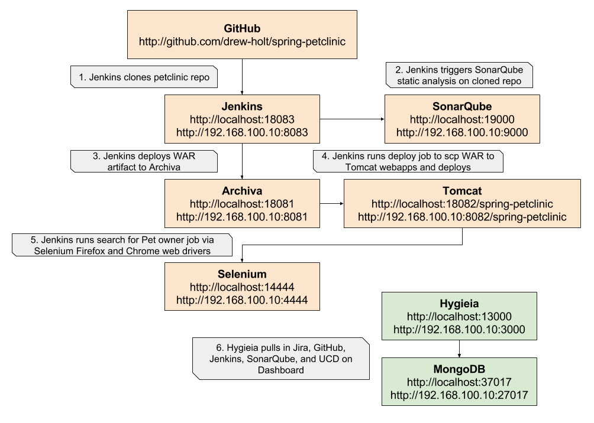

hygieia-dev-baked Vagrant Box
========================
A baked vagrant box that spins up a pipeline consisting of archiva, github, sonarqube, jenkins, tomcat, and hygieia.

The unbaked version can be found here: https://github.com/liatrio-chef/hygieia-dev-unbaked

The baked version can be found here: https://github.com/liatrio-chef/hygieia-dev-baked

Requirements
------------
Vagrant 1.8.1

Usage
-----
`git clone git@github.com:liatrio/hygieia-dev-baked.git`

`vagrant up`

Pipeline (Internal IP 192.168.100.10)
- Jenkins - Browse to [http://localhost:18083/](http://localhost:18083/)
  - may need to build petclinic 1-3x due to network issues if archiva fails to mirror artifacts
  - on successful build the war is deployed to the tomcat instance by scp'ing the artifact from archiva to /opt/tomcat_petclinic/webapps

- Archiva - Browse to [http://localhost:18081/](http://localhost:18081/)
  - admin :: admin1
  - snapshots :: snapshots1
  - deploy :: deploy1

- Sonarqube - Browse to [http://localhost:19000/](http://localhost:19000/)
  - admin :: admin

- Tomcat - Browse to [http://localhost:18082/](http://localhost:18082/)
  - petclinic is deployed to a link in the form of [http://localhost:18082/spring-petclinic-4.2.4-20160314.054124-1/](http://localhost:18082/spring-petclinic-4.2.4-20160314.054124-1/) - which can be be derived from the jenkins build console output

- Hygieia - Browse to [http://localhost:13000/](http://localhost:13000/)
  - admin :: password
  - an existing spring-petclinic dashboard is configured

Configuration
-------------
Modify /home/vagrant/dashboard.properties to point to your existing servers and then restart all collectors by running:

 `cd /etc/systemd/system; sudo systemctl restart hygieia-*`

License and Authors
-------------------
Authors: drew@liatrio.com
